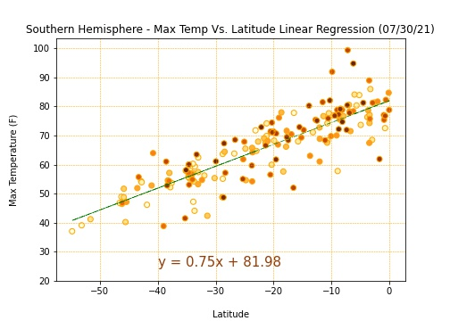
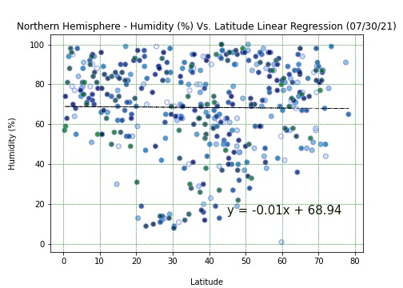
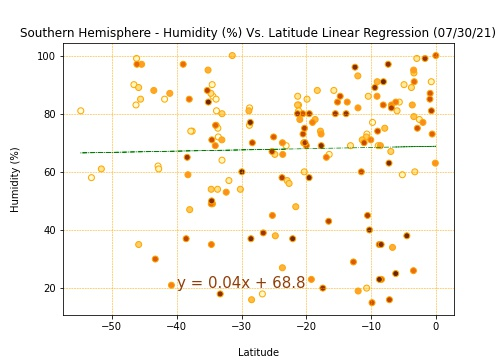
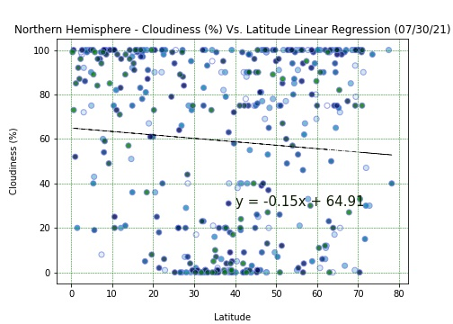
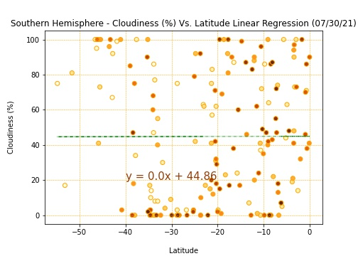
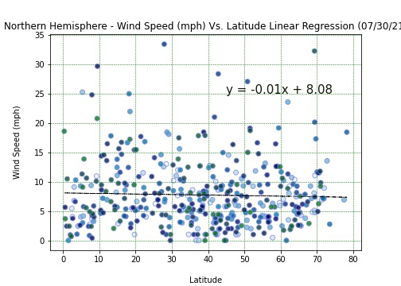
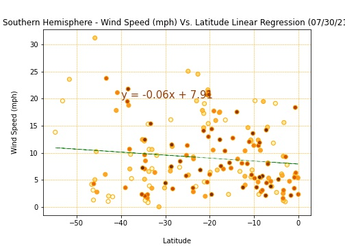
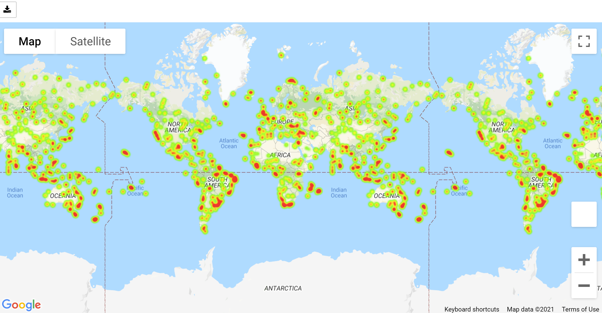

# Python API Challenge - What's the Weather Like?

## Background

Created a Python script to visualize the weather of 500+ cities across the world of varying distance from the equator by utilizing [Python library - citipy](https://pypi.python.org/pypi/citipy), and the [OpenWeatherMap API](https://openweathermap.org/api), to create a representative model of weather across world cities.

The script does the following : 

* Randomly selects **at least** 500 unique (non-repeat) cities based on latitude and longitude.
* Perform a weather check on each of the cities using a series of successive API calls.
* Includes a print log of each city as it's being processed with the city number and city name.
* Saves a CSV of all retrieved data and a PNG and JPEG image for each scatter plot.

## Part I - WeatherPy
Created a series of scatter plots to showcase the following relationships:
    <table width="80">
    <tr>
    <td width="20%"></td>
    <td width="20%"></td>
    <td width="20%"></td>
    <td width="20%"></td>
    </tr></table>
* Temperature (F) vs. Latitude
* Humidity (%) vs. Latitude
* Cloudiness (%) vs. Latitude
* Wind Speed (mph) vs. Latitude

The note book "WeatherPy.ipynb" has detailed explanation on what the code is analyzing.

Created a linear regression on each relationship. Created seperate sets of plots for Northern Hemisphere and Southern Hemisphere:
    <table width="80%">
    <tr>
    <td width="10%"></td>
    <td width="10%"></td>
    <td width="10%"></td>
    <td width="10%"></td>
    <td width="10%"></td>
    <td width="10%"></td>
    <td width="10%"></td>
    <td width="10%"></td>    
    </tr></table>
* Northern Hemisphere - Temperature (F) vs. Latitude
* Southern Hemisphere - Temperature (F) vs. Latitude
* Northern Hemisphere - Humidity (%) vs. Latitude
* Southern Hemisphere - Humidity (%) vs. Latitude
* Northern Hemisphere - Cloudiness (%) vs. Latitude
* Southern Hemisphere - Cloudiness (%) vs. Latitude
* Northern Hemisphere - Wind Speed (mph) vs. Latitude
* Southern Hemisphere - Wind Speed (mph) vs. Latitude

After each pair of plots, find explanation on what the linear regression is modeling and other observations, if any.

### Part II - VacationPy

Used jupyter-gmaps and the Google Places API for this fun exercise .

* Created a heat map that displays the humidity for every city from Part I.

  

* Narrowed down the DataFrame to find ideal weather condition. For example:

  * A max temperature lower than 80 degrees but higher than 70.

  * Wind speed less than 10 mph.

  * Zero cloudiness.

  * Dropped any rows that didn't contain all three conditions. We want to be sure the weather is ideal.

* Using Google Places API to fetch the first hotel for each city located within 5000 meters of search coordinates.

* Plotted the hotels on top of the humidity heatmap with each pin containing the **Hotel Name**, **City**, and **Country**.

  

#### Key notes:
* Saved images in both 'png' and 'jpeg' formats.
* Analysis was done using a Jupyter notebook.
* Defined and used functions
* Used citipy and OpenWeatherMap API and gmaps
* Used Matplotlib or Pandas plotting libraries.
* For Part I, Find written description of three observable trends based on the data at the top of notebook.
* For Part II, included a screenshot of the heatmap and saved it to the folder.
* Used proper labeling plots, including aspects like: Plot Titles (with date of analysis) and Axes Labels.
* Used color maps.
* For max intensity in the heat map, set the highest humidity found in the data set.

#### Execution:
  * Important : Please download the repository.
  * The script for Part I is in the Jupyter notebook 'WeatherPy.ipynb' which can be located in the folder WeatherPy.
    * Find written description of three observable trends based on the data at the top of notebook.
  * The script for Part II is in the Jupyter notebook 'VacationPy.ipynb' which can be located in the folder WeatherPy.
    * Find a screenshot of the heatmaps in the folder 'WeatherPy/Heat_Maps'
  * Both files have detailed comments explaining each segment.
    
#### Results:
   * Tested it multiple times.
   * All the segments of Jupyter notebook executed successfully generating the final report.
   * Successfully displays required output results, plots and maps.

###### eRRORS !!!! What ERRORS ????
* REST ASSURED, the code runs error free. Just Follow these detailed instructions ....

